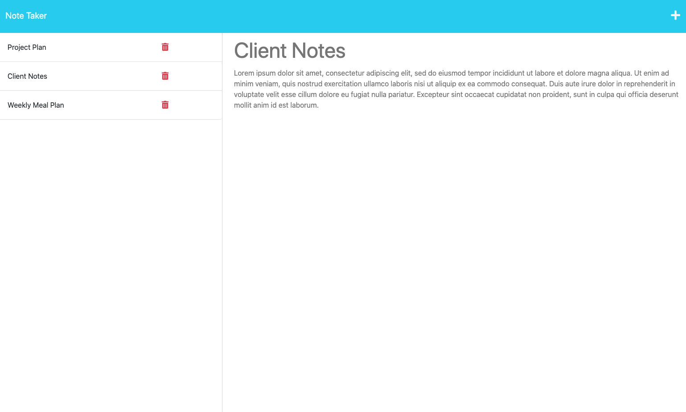

# Note Tracker

## Badges

## Description
A simple note-taking web app, allowing the user to effortlessly jot down and store their thoughts, ideas, and important information for convenient access at any time.

## Table of Contents
- [Features](#features)
- [Installation](#installation)
- [Screenshot](#screenshot)
- [License](#license)
- [Questions](#questions)

## Features
- Add titled notes
- Save notes for later access
- Delete unwanted notes

## Installation
The app can be accessed at _______[heroku]

## Screenshot

## License
All assets and code are under MIT License unless specified otherwise.

## Questions
Any questions? Visit my GitHub profile at [https://github.com/katyjmt](https://github.com/katyjmt) or email me at [katyjmt@gmail.com](katyjmt@gmail.com).